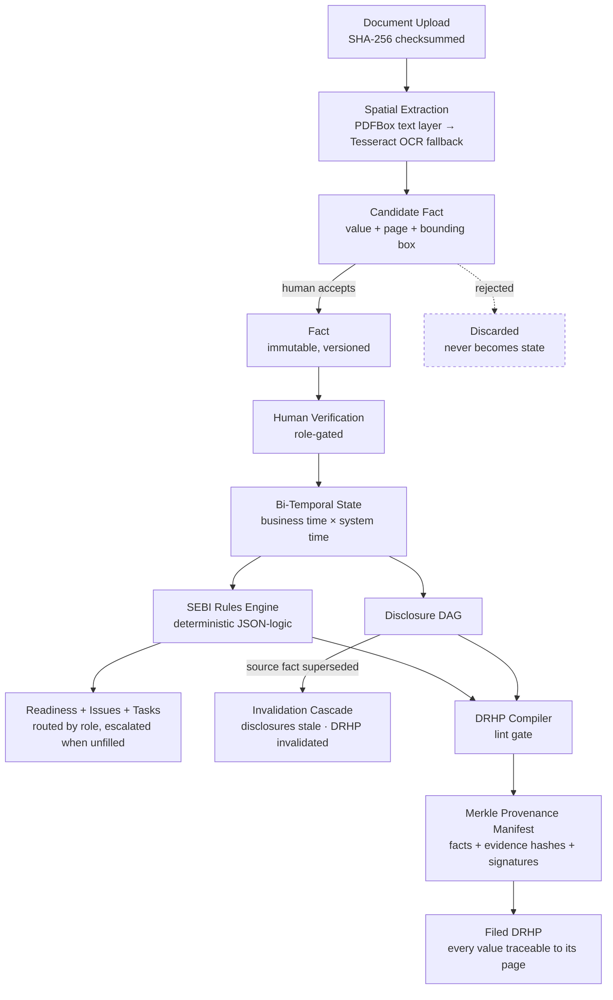

<div align="center">

# Syndicate

### Infrastructure for Public Market Transactions
**Turning Company Reality into Verified State**

[](https://openjdk.org/)
[](https://spring.io/projects/spring-boot)
[](https://react.dev/)
[](https://www.postgresql.org/)
[](#license)

</div>

---

## The thesis

An IPO is not fundamentally a PDF.

It is a controlled transformation of a private company into a public one, and the prospectus is
merely a *representation* of the state at the end of it. The hard problem is not generating the
document — it is establishing trustworthy company state before representing it publicly.

Today that state lives scattered across email, Excel, WhatsApp, and successive PDF drafts. The same
number exists in five places with no agreement on which is correct, no record of who verified it,
and no way to know what else breaks when it changes.

> **Syndicate maintains a continuously verified representation of the company and the transaction,
> coordinates the people responsible for establishing that truth, preserves the evidence behind
> every material assertion, and produces the regulatory output from that verified state.**

The document is an **output** of verified state, never the system of record.

---

## System architecture



The extraction pipeline runs on a **durable RabbitMQ queue**, not in-process threads — a server
restart mid-parse resumes the job rather than dropping it silently.

---

## Core architectural invariants

These survive every future change to the system.

| Invariant | What it means | How it is enforced |
|---|---|---|
| **Zero AI Authority** | Automated extraction produces *candidates*, never facts. A number no human accepted cannot reach a filing. | `CandidateFactService.accept()` is the only code path that constructs a `Fact`. The DRHP compiler resolves placeholders **only** against `VERIFIED` facts — an unaccepted extraction has no `Fact` row, so the compile fails rather than printing it. |
| **Bi-Temporal Dual Axes** | Two independent timelines: when a fact was *true in the world*, and when Syndicate *believed it*. | `valid_from`/`valid_to` alongside `created_at`/`system_superseded_at`. `?asOf=` reconstructs what the system believed at any past instant — real time travel, not an audit log. |
| **Immutable Versioning** | Facts are never overwritten. A correction creates a new version and supersedes the old one. | Self-referential `supersedes_fact_id` chain; `PUT` always inserts. Full history via `GET /api/facts/{id}/history`, resolvable from *any* version in the chain. |
| **Invalidation Cascades** | Changing a fact must never leave derived work silently stale. | Superseding walks the dependency DAG: dependent disclosures become `STALE_REQUIRING_REVIEW`, any compiled DRHP citing the fact is `INVALIDATED`, and the rules engine re-evaluates. |
| **Deterministic Compliance** | Regulatory verdicts are reproducible and defensible, never model output. | A JSON-logic evaluator over a DB-backed rule registry. Same facts in, same verdict out — there is no model call anywhere in the evaluation path. |
| **Merkle Provenance** | A filing carries cryptographic proof of the exact state it was built from. | SHA-256 Merkle tree over cited fact *versions*, evidence file hashes, and approval signatures. Leaves are sorted canonically; an odd node is promoted, not duplicated, avoiding Merkle malleability. |
| **Dual-Key Approval** | Material transitions need more than one person. | `DRAFT → ACTIVE` requires signatures from **both** the Issuer Admin and the Lead Banker. |
| **Append-Only Audit** | The record of what happened cannot be rewritten. | `audit_events` has no setters and no update or delete path anywhere in the application. |

---

## Quickstart

**Prerequisites:** Docker and Docker Compose v2. Nothing else — no JDK, Node, or Postgres needed.

```bash
git clone <your-fork-url> syndicate
cd syndicate
./start.sh
```

That single command:

1. Creates `.env` from `.env.example` if missing
2. Starts PostgreSQL, RabbitMQ, the API, and the web app
3. Runs Flyway migrations automatically on API startup
4. Waits for health checks and prints the URLs

| Service | URL |
|---|---|
| Web app | http://localhost:5173 |
| API | http://localhost:8080/api |
| RabbitMQ console | http://localhost:15672 (`guest` / `guest`) |

```bash
./start.sh --rebuild   # force a rebuild of the app images
./start.sh --logs      # follow logs after starting
./start.sh --down      # stop everything
```

Equivalent to `docker compose up --build` — `start.sh` adds preflight checks, health waiting, and a
readable summary.

> **First run takes a few minutes.** It compiles the Spring Boot backend and installs Tesseract for
> the OCR fallback path.

### First steps in the app

1. **Register** — this also creates your organization
2. **Add a company** and **open a transaction** on it
3. **Create a workstream** (e.g. Financial Due Diligence)
4. **Upload a PDF** on the Documents tab and watch it parse live
5. **Accept a candidate fact**, then verify it
6. **Re-evaluate rules**, then **compile the DRHP**

### Running without Docker

<details>
<summary>Local development setup</summary>

```bash
# Postgres + RabbitMQ only
docker compose up -d postgres rabbitmq

# Backend (Flyway migrations run on boot)
cd backend && mvn spring-boot:run

# Frontend
cd frontend && npm install && npm run dev
```

Requires JDK 17, Maven, Node 20, and `tesseract-ocr` on `PATH` for the OCR fallback.
</details>

---

## Feature walkthrough

### 1 · Ingestion and spatial evidence grounding

Every upload is SHA-256 checksummed, parsed for a real text layer with **Apache PDFBox**, and falls
back to **Tesseract OCR** when there isn't one. Extracted values become `CandidateFact` records
carrying the **exact page and bounding box** they came from — reviewers see the number highlighted
on the source page, not a filename reference.

Processing is a durable queue with a dead-letter exchange, retry with backoff, and an idempotent
consumer. Progress streams to the browser over **Server-Sent Events**.

### 2 · Invitations and scoped RBAC

GitHub-style invitations (`PENDING → ACCEPTED | REJECTED | EXPIRED | REVOKED`) for individuals or
whole advisory firms, with opaque tokens and a public preview page. Permissions are enforced in the
service layer: only an Auditor or Issuer Admin may verify financial facts; only Legal Counsel may
resolve litigation issues; status transitions need dual signatures.

### 3 · Bi-temporal fact history

```
Registered Office
  v1  Mumbai      valid 2024-04-01 → 2025-01-15   recorded 12 Sep, superseded 12 Sep
  v2  Bengaluru   valid 2025-01-15 → current      recorded 12 Sep
```

Ask the system what it believed at any instant with `?asOf=` and get the *then-current* answer.

### 4 · Deterministic SEBI rules engine

Three SEBI SME rules ship seeded: post-issue capital ceiling (₹25 Cr), EBITDA track record (positive
in 2 of 3 years), and licence validity at filing. Rules are **data**, not code — JSON-logic
expressions in a DB registry. A failing rule opens a `BLOCKING` issue in the owning workstream and
auto-resolves when it passes again.

Readiness resolves to `NOT_READY`, `CONDITIONALLY_READY`, or `READY_FOR_FILING`.

### 5 · Task engine with role routing and escalation

Failing rules synthesize tasks routed to whoever holds the required seat. When **nobody** holds it,
the task becomes `UNASSIGNED_ESCALATED` and both deal leads get a high-priority notification —
because the missing advisor is the real blocker and only they can invite one. Kanban board with
drag-and-drop.

### 6 · Disclosures, DAG, and the DRHP compiler

Disclosures are prose with `{{fact:Label}}` placeholders. Compiling refuses unless **every** gate
passes: no failing rule, no stale disclosure, and every placeholder resolving to exactly one
human-verified fact.

A `FINAL_FILING` compile produces a **Merkle provenance manifest**. The inspector shows every leaf —
cited facts with version numbers, evidence SHA-256 hashes, approval signatures — each with its audit
path, downloadable as JSON so the root can be recomputed offline without trusting the server.

### 7 · Registry verification and conflict detection

Cross-check a company against an external corporate registry through a pluggable
`ExternalRegistryService` (a deterministic MCA mock ships by default). Disagreements raise `HIGH`
issues showing **both** values side by side.

The same principle governs internal conflicts: when two sources disagree on the same fact,
Syndicate raises an issue naming every competing value and **never silently picks a winner**.

---

## Tech stack

| Layer | Choice | Why |
|---|---|---|
| API | Spring Boot 3.3, Java 17 | Modular monolith (spec §51) — one deployable, clear package-by-feature boundaries |
| Database | PostgreSQL 16 + Flyway | `ddl-auto: validate`; schema changes are reviewed migrations, never generated |
| Queue | RabbitMQ | Durable extraction jobs with DLQ — a restart must not drop a parse |
| Extraction | Apache PDFBox 3, Tesseract 5 | Real text-layer geometry first, OCR only as fallback |
| Web | React 18 + Vite + React Router | Client-side routing, no full reloads |
| Auth | JWT (jjwt) + BCrypt | Stateless; access control lives in the service layer, not annotations |

---

## Project layout

```
backend/src/main/java/com/syndicate/
├── audit/         append-only audit trail
├── candidatefact/ the Zero AI Authority boundary
├── conflict/      contradiction detection
├── drhp/          disclosures, dependency DAG, compiler + lint gate
├── fact/          immutable bi-temporal facts
├── ingestion/     PDFBox / Tesseract / matcher / queue consumer
├── permission/    role → permission matrix
├── provenance/    Merkle tree and filing manifests
├── regulatory/    rules registry and readiness engine
├── registry/      external registry adapters
└── task/          routing, escalation, Kanban state
```

---

## Contributing

1. Fork and branch from `main`
2. Keep access control in the service layer — never trust the client
3. Schema changes are new Flyway migrations; never edit an applied one
4. Run `mvn -o test` (backend) and `npx oxlint src` (frontend) before opening a PR
5. Preserve the invariants above — especially **Zero AI Authority**. If a change lets an unverified
   value reach a filing, it is wrong regardless of how convenient it is.

---

## License

MIT — see [LICENSE](LICENSE).

<div align="center">
<sub>Building trusted markets for a stronger India.</sub>
</div>
