<div align="center">

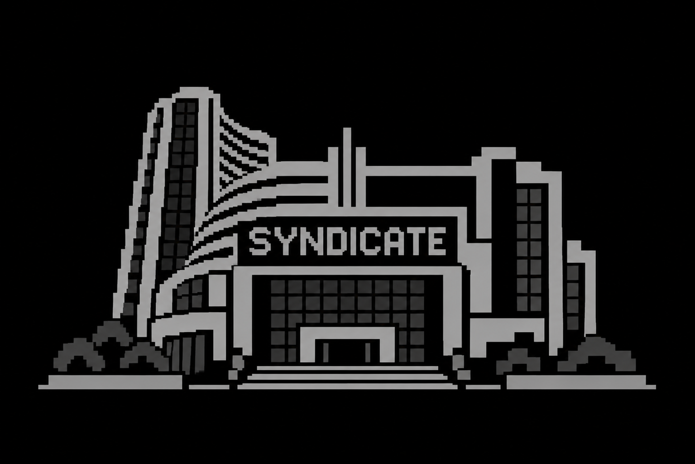

# Syndicate

**Diligence and Disclosure-Control Infrastructure for Public-Market Transactions**

*A working system and technical report*

Version 0.1.0 · October 2026 · Reference implementation: Indian SME IPO

[](../../actions/workflows/ci.yml)
[](https://openjdk.org/)
[](https://spring.io/projects/spring-boot)
[](https://www.postgresql.org/)
[](https://react.dev/)
[](LICENSE)

</div>

---

## Abstract

> A public issue is commonly treated as a document-production problem: the draft offer document is
> written, reviewed, and filed. This report argues that the document is the *last* and least
> interesting artefact of the process, and that the real problem is **establishing, reconciling and
> maintaining the information state** the document represents. During an SME IPO that state is
> scattered across spreadsheets, email threads and successive PDF drafts; the same figure appears in
> several places with no agreement on which is correct, no record of who verified it, and no way to
> determine what else is invalidated when it changes.
>
> Syndicate is an implemented system that holds this state explicitly. Source documents are
> preserved and hashed; machine extraction produces *candidates*, never facts; a fact enters the
> transaction only by human acceptance and becomes authoritative only on independent verification;
> contradictions between sources are raised, blocked and resolved by a named person with a recorded
> reason; the offer document is compiled from verified facts and refuses to compile otherwise; and
> every filing artefact carries a manifest identifying the exact state that produced it.
>
> The report describes the object model (§3), the implementation (§4), an operational walkthrough
> with figures (§5), the verification strategy and its results (§6), and the deployment model (§7).
> It closes with the system's limitations, which are substantial and stated plainly (§8).

**Keywords:** due diligence, disclosure control, offer documents, evidence provenance, change-impact
analysis, bitemporal data, four-eyes verification, SME IPO.

---

## Contents

| § | Section |
|---|---|
| 1 | [Introduction](#1-introduction) |
| 2 | [Design principles](#2-design-principles) |
| 3 | [The object model](#3-the-object-model) |
| 4 | [Implementation](#4-implementation) |
| 5 | [Operation](#5-operation) |
| 6 | [Verification](#6-verification) |
| 7 | [Deployment](#7-deployment) |
| 8 | [Limitations and non-goals](#8-limitations-and-non-goals) |
| 9 | [Further work](#9-further-work) |
| — | [References](#references) · [Appendices](#appendix-a--repository-layout) · [Licence](#licence) |

---

## 1. Introduction

### 1.1 The problem

Merchant bankers carry formal diligence responsibility for a public issue. The information they
rely on arrives as documents — audited statements, bank statements, board resolutions, licences,
litigation papers, registry extracts — and is consumed as *assertions*: revenue for the year,
promoter shareholding at a date, the validity of a licence at filing. Between document and
assertion sits work that is almost entirely undocumented: someone read a page, decided what it
established, and typed a number somewhere else.

That gap produces four recurring failures:

1. **No agreed value.** The same figure exists in several places and nothing records which is current.
2. **No traceable basis.** A number in the draft cannot be followed back to the page it came from.
3. **No independent check.** The person who entered a figure is often the only person who ever saw it.
4. **No change propagation.** A corrected figure leaves stale disclosures, stale approvals and a
   filing copy that silently no longer matches the record.

### 1.2 Regulatory context

The environment has been tightening. SEBI's December 2024 circular requires merchant bankers to
maintain the documents relied upon during diligence in an online repository, for draft offer
documents filed on or after 1 January 2025 [1]. BSE's guidance for SME IPO merchant bankers calls
for verification across past fundraising, valuation, bank statements, utilisation of funds,
third-party vendors, litigation, auditor changes, working capital, net worth, leverage and
related-party transactions — a cross-source problem, not a single-document one [2]. In 2024 BSE
cautioned merchant bankers after discrepancies surfaced in SME IPO processes [3], and SEBI's
enforcement record shows that diligence failures become regulatory matters [4].

A repository answers *where the documents are*. It does not answer what they establish, whether
sources agree, who verified it, or what depends on it. That is the gap this system addresses.

A note on scope: BSE has introduced a generative-AI pre-check for SME IPO offer documents [5].
"AI checks the draft for errors" is therefore not a product thesis. Syndicate operates *beneath* the
document layer.

### 1.3 Contribution

This repository contains a working system, not a proposal. Specifically:

- an explicit object model separating evidence, candidates, facts, disclosures and documents (§3);
- a dependency graph over relational tables, with change-impact analysis computed from persisted
  relationships rather than assumptions (§3.3);
- enforcement of the verification boundary in service logic, database constraints and tests (§6.2);
- a filing package carrying a Merkle manifest of the exact state that produced it (§5.7);
- 134 automated tests, including a golden-path test that drives an entire transaction through the
  public API from empty deal to provenance-backed document (§6).

---

## 2. Design principles

These are the system's rules. They are enforced, not aspirational; §6.2 lists the test that holds
each one.

| # | Principle | Consequence in the system |
|---|-----------|---------------------------|
| P1 | Preserve the source | Evidence is content-addressed, hashed, write-once; deletion is replaced by archival |
| P2 | Separate observation from truth | Extraction yields candidates; only a person creates a fact |
| P3 | Material facts need a second pair of eyes | A material fact cannot be verified by whoever recorded it |
| P4 | Never silently resolve a contradiction | Conflicts block verification until a person records a decision and a reason |
| P5 | Version material state | Corrections create versions; prior values are retained, never overwritten |
| P6 | Make dependencies explicit | Every derived artefact records the exact version it was built from |
| P7 | Invalidate downstream state on change | A change marks dependents stale in the same database transaction |
| P8 | Documents are derived artefacts | Compilation fails closed; it never prints an unverified value |
| P9 | Decisions must be explainable | Readiness is a list of blockers, never a score |
| P10 | The system never claims regulatory approval | Rule outcomes are stated as configured checks against recorded data |

---

## 3. The object model

### 3.1 The chain

```
Evidence ──▶ Candidate Fact ──▶ Fact ──▶ Disclosure ──▶ Document ──▶ Filing package
    │            (machine)      (human)       │             │              │
    │                                          │             │              │
    └──────────── hashed, versioned ───────────┴── dependency graph ────────┘
                                                        │
                            Reviews · Approvals · Conflicts · Observations
```

Each arrow is a boundary with a rule attached. The arrow from **Candidate** to **Fact** is the one
the rest of the system is built to protect: machine output is a proposal with a page region
attached, and a person must accept it. The arrow from **Fact** to **Disclosure** is the one that
makes change tractable: the disclosure records the fact version it quoted.

### 3.2 Facts

A fact is identified by a **semantic key** from a catalogue (`issuer.revenue`,
`issuer.promoter_ownership_pct`, `issue.post_issue_paid_up_capital`, …), not by a display label.
Two documents calling the same thing "Turnover" and "Revenue from operations" resolve to one key,
which is what makes contradiction detectable at all. Values are compared after normalisation across
Indian scales, so ₹42.18 crore and ₹4,218 lakh are recognised as the same figure.

Facts are **bitemporal**: business validity (when the fact was true of the company) is independent of
system time (when Syndicate came to believe it). This distinction is what separates a legitimate
succession from a contradiction: 51% until 31 August and 49% from 1 September is a sequence; 49%
from 1 September and 51% as of 30 September is a conflict.

### 3.3 The dependency graph

Dependencies are a SQL view over the link tables that already exist — disclosure-to-fact,
document-to-fact, fact-to-evidence, review-to-fact, approval-to-document — expressed in one uniform
shape:

```
from_type, from_lineage_id   the dependent          (DISCLOSURE, DOCUMENT, REVIEW, APPROVAL, FACT)
to_type,   to_lineage_id     what it depends on     (FACT, EVIDENCE, DOCUMENT)
pinned_version_id            the exact version it was built from
pinned_is_current            false once a newer version exists → the dependent is stale
```

Because it is a view, the graph cannot drift from the links it describes, and staleness is computed
in SQL rather than maintained by application code. Traversal is breadth-first, cycle-safe and
confined to one transaction. Everything downstream of a change — §5.8 — comes from this view.

---

## 4. Implementation

### 4.1 Shape

A modular monolith in Java, a React front end compiled into it, and PostgreSQL. There is no message
broker: background work (OCR, extraction) runs on a Postgres job table claimed with
`FOR UPDATE SKIP LOCKED`, enqueued inside the transaction that creates the work, so a document
cannot be stored and then silently never processed.

| Layer | Technology | Notes |
|-------|-----------|-------|
| API, domain, workers | Java 17, Spring Boot 3.3 | Single process; 33 modules under `com.syndicate` |
| Persistence | PostgreSQL 16, Flyway | 26 migrations, `V1`–`V26`; `ddl-auto=validate` |
| Extraction | Apache PDFBox, Tesseract OCR | Text layer first, OCR fallback, spatial anchors retained |
| Front end | React 19, Vite 8 | Compiled into the API's static resources — one origin, no CORS |
| Packaging | Docker, Compose | Two containers: the product and its database |

### 4.2 Module map

| Area | Modules |
|------|---------|
| Evidence and ingestion | `evidence`, `ingestion`, `candidatefact`, `jobs` |
| Transaction truth | `fact`, `conflict`, `review`, `graph` |
| Diligence and control | `diligence`, `workbench`, `regulatory`, `issue`, `task` |
| Output | `drhp`, `provenance`, `filing`, `observation`, `lifecycle` |
| Identity and access | `auth`, `user`, `organization`, `transaction`, `permission`, `invitation` |
| Cross-cutting | `audit`, `notification`, `registry`, `common`, `stream`, `onboarding` |

### 4.3 Numbers

| Measure | Value |
|---------|-------|
| Backend source files | 293 |
| HTTP endpoints | 112 |
| Database migrations | 26 |
| Front-end source files | 68 |
| Automated tests | 134 (33 unit, 101 integration) |

---

## 5. Operation

The figures below are screenshots of the running system, captured by script against a seeded
transaction. All data is synthetic; "Shree Polymers Limited" is not a real issuer.

### 5.1 The workbench

The default view answers one question: *what prevents this transaction from being submitted with
confidence right now?* Not a completion percentage — a list of blockers, each naming the object it
concerns, the reason, and what would clear it. Readiness is derived from the strongest blocker.

<p align="center">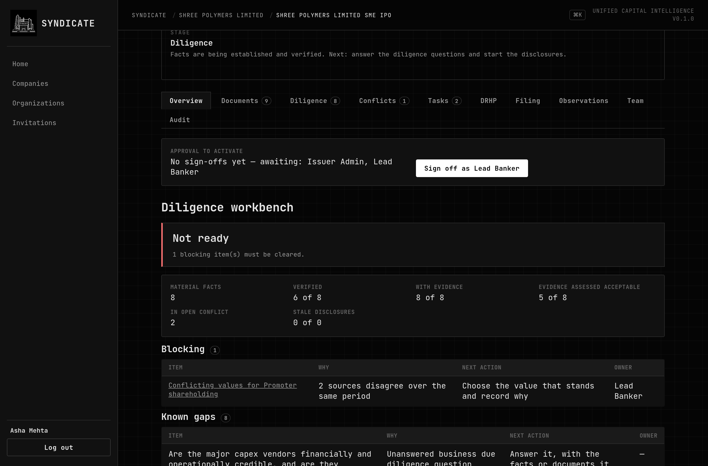</p>
<p align="center"><em><strong>Figure 1.</strong> Readiness derived from blockers, with evidence coverage as counts.</em></p>

### 5.2 Extraction proposes; a person decides

Uploads are hashed, stored write-once, parsed for a text layer and OCR'd when there is none.
Recognised figures become **candidates**, each anchored to the page region it came from. A candidate
is not a fact and cannot be used anywhere until a person accepts it.

<p align="center">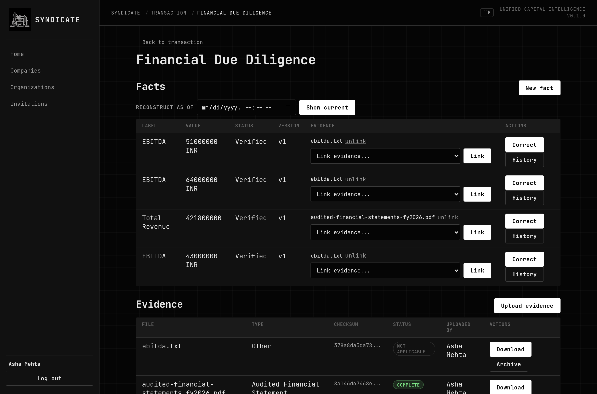</p>
<p align="center"><em><strong>Figure 2.</strong> Candidates extracted from an audited statement, each showing its source region.</em></p>

### 5.3 Every value can be walked back

An accepted value retains its lineage: who accepted it, who verified it, the document behind it, and
the exact region of the page the number was read from.

<p align="center">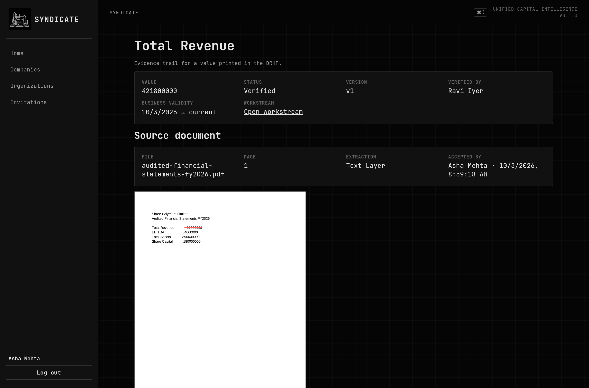</p>
<p align="center"><em><strong>Figure 3.</strong> A verified fact, its evidence, and the highlighted region of the source page.</em></p>

### 5.4 Contradiction is explicit

Two sources describing the same key over overlapping validity with different values produce a
conflict. The system refuses to choose: it blocks verification of either value, shows both with
their documents and dates, and waits. Resolution records the chosen value, the rejected values, the
reason, the reviewer and the evidence considered. Rejected values are retained.

<p align="center">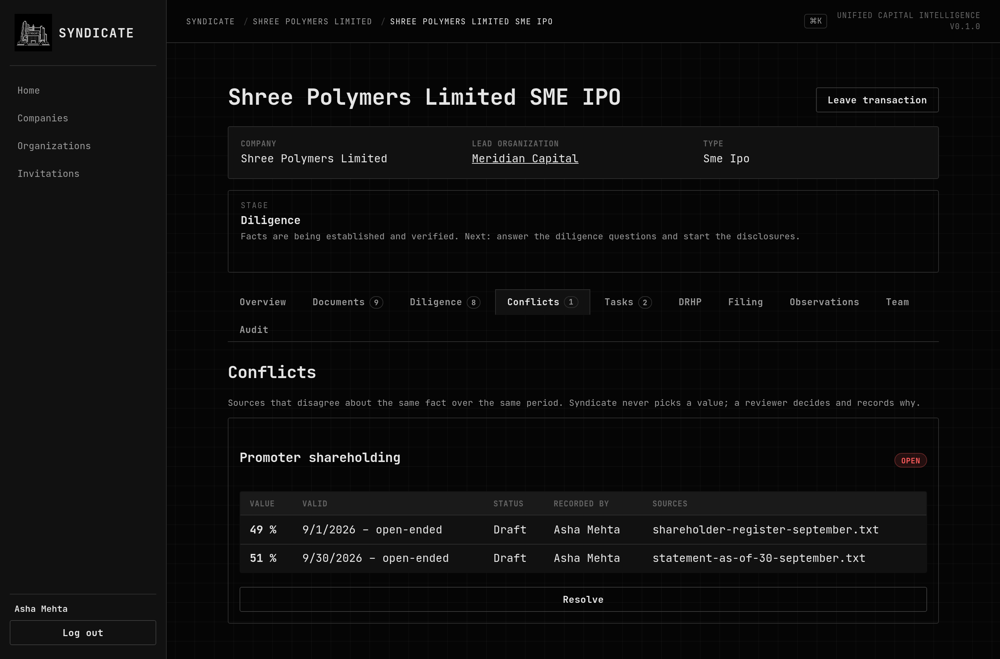</p>
<p align="center"><em><strong>Figure 4.</strong> 49% and 51% over overlapping periods, with both sources shown and neither chosen.</em></p>

### 5.5 Diligence as state

Every transaction opens with the questions an SME issue must answer, drawn from the areas named in
BSE's guidance [2]. An answer must point at the facts or documents it rests on, and is accepted by
someone other than its author. Unanswered blocking questions prevent a filing copy from compiling.

<p align="center">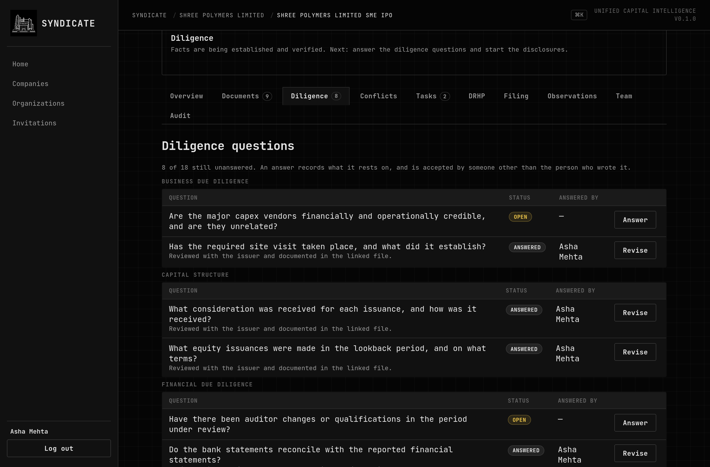</p>
<p align="center"><em><strong>Figure 5.</strong> The question set, grouped by area, with status and answerer.</em></p>

### 5.6 Compilation fails closed

Disclosures cite facts by key (`{{fact:issuer.revenue@FY2026}}`), inserted through a picker rather
than typed. Compilation resolves every reference against verified facts and refuses when anything is
stale, unresolved, unverified, contradicted, or waiting on a blocking question.

<p align="center">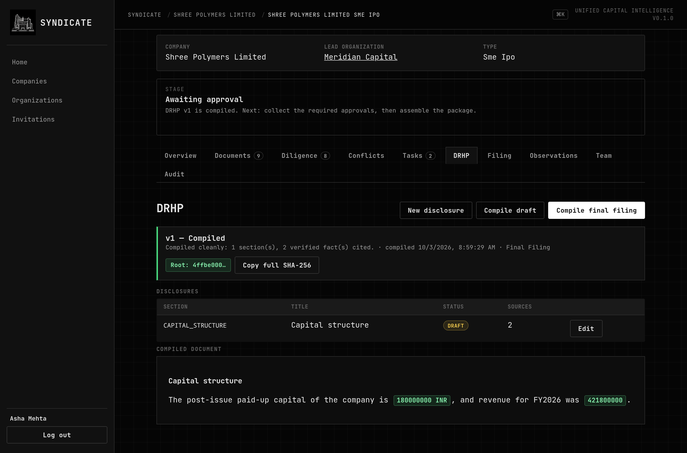</p>
<p align="center"><em><strong>Figure 6.</strong> A clean compile; each printed value remains linked to the fact behind it.</em></p>

### 5.7 Proof of what produced the filing

A filing copy carries a Merkle manifest over every cited fact version, every evidence hash and every
approval. The manifest is recomputed when read, so the response proves itself rather than asserting
a stored value.

<p align="center">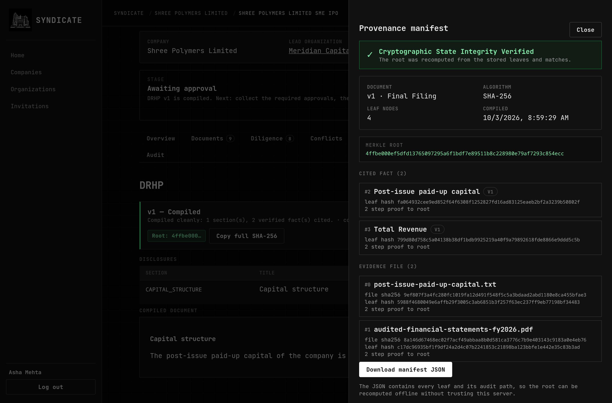</p>
<p align="center"><em><strong>Figure 7.</strong> The manifest, its leaves and their audit paths, verified on read.</em></p>

Approval is given by named people in required roles against one exact version. Only an approved,
unchanged document can be assembled into a package: the compiled document, an index of every
document relied upon with hashes, the manifest, and a certificate of who approved what.

<p align="center">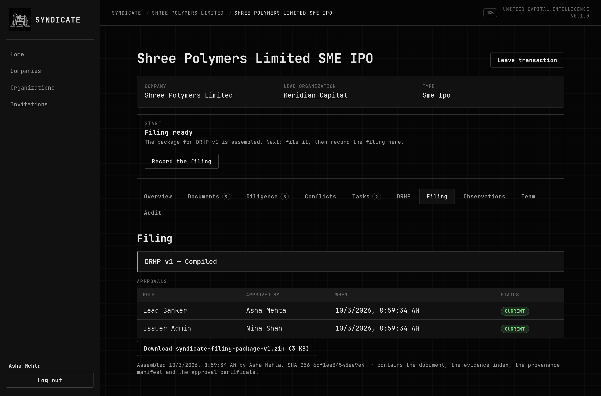</p>
<p align="center"><em><strong>Figure 8.</strong> Approvals against one version, and the assembled package with its checksum.</em></p>

**Syndicate does not file anything.** It produces a filing-ready package and the proof of what
produced it; submission remains with the people responsible for it.

### 5.8 Change impact

Before an approved figure is corrected, the system states what the change reaches — computed from
the dependency graph, not from assumptions about what usually depends on what.

<p align="center">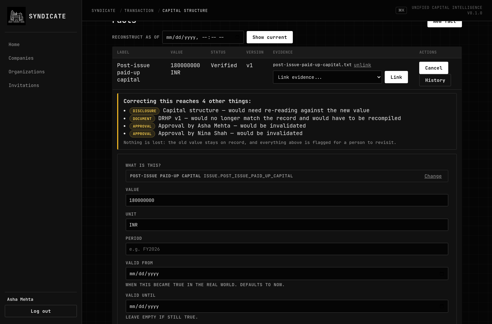</p>
<p align="center"><em><strong>Figure 9.</strong> The disclosure, the compiled document and both approvals that this correction would reach.</em></p>

### 5.9 The record

The audit trail is append-only and hash-chained. The database rejects updates and deletions by
trigger, the chain is verifiable through the API, and the trail outlives the transaction it
describes.

<p align="center">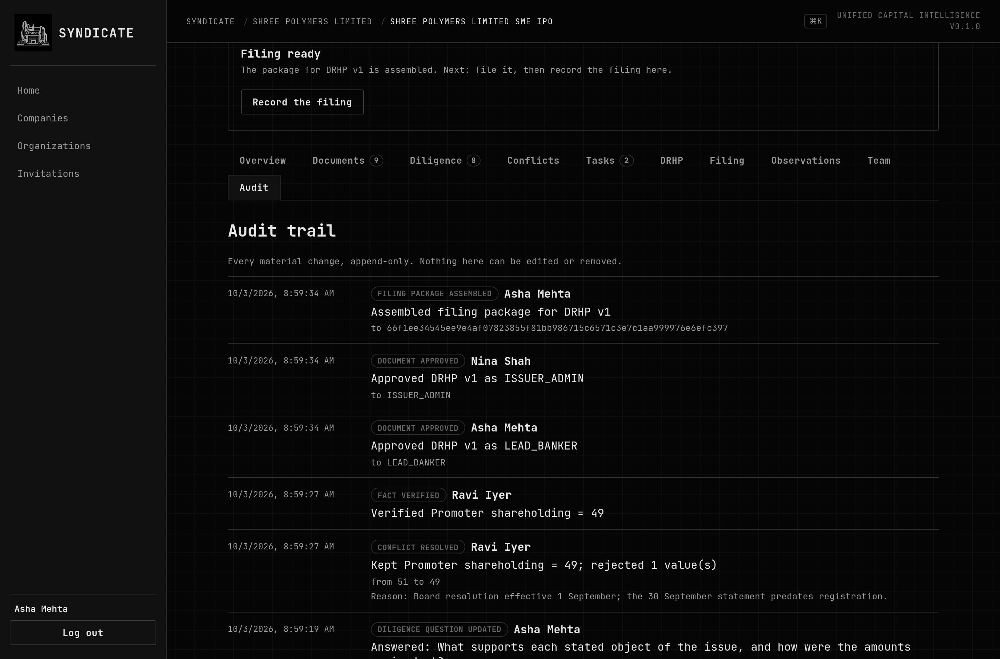</p>
<p align="center"><em><strong>Figure 10.</strong> Who did what, against which version, and why.</em></p>

### 5.10 Demonstration

A five-minute walkthrough of the above, recorded against the running system, is produced by
[`demo/record-demo.mjs`](demo/record-demo.mjs); the narration is in
[`demo/voiceover-script.md`](demo/voiceover-script.md).

---

## 6. Verification

### 6.1 Strategy

The system is too stateful for unit tests alone. Integration tests run against real PostgreSQL via
Testcontainers and exercise the public HTTP API, so they traverse the same authorisation, validation
and transaction boundaries as a user.

| Layer | Count | What it covers |
|-------|-------|----------------|
| Unit | 33 | Value normalisation, PDF geometry, OCR parsing, readiness derivation, checksums |
| Integration | 101 | Every workflow through the API, against real Postgres |
| — of which security | 12 | Cross-organisation isolation, role matrix (12 roles), sessions, upload safety |
| — of which end-to-end | 3 | Golden path, filing package, lifecycle |

```bash
cd backend && ./mvnw verify        # unit + integration (requires Docker)
cd frontend && npm run lint && npm run build
```

### 6.2 Invariants under test

| Principle | Test |
|-----------|------|
| P1 Preserve the source | `EvidenceCustodyIT` — versioning, archival refusal while referenced, integrity re-hash |
| P2 Observation ≠ truth | `CandidateBoundaryIT` — acceptance yields a draft fact, never a verified one |
| P3 Second pair of eyes | `CandidateBoundaryIT` — service refusal *and* a `CHECK` constraint |
| P4 No silent resolution | `OwnershipConflictIT` — the full §65 scenario, including reopening |
| P5 Versioning | `FactSemanticKeyIT`, `ConcurrentCorrectionIT` — lineage kept; racing corrections cannot both win |
| P6/P7 Dependencies and staleness | `ChangePropagationIT`, `ImpactPreviewIT` |
| P8 Fail-closed compilation | `GoldenPathIT`, `FilingPackageIT` |
| P9 Explainability | `WorkbenchIT`, `DerivedReadinessTest` |
| Audit integrity | `AuditIntegrityIT` — trigger refusal, chain verification, tamper detection |
| Access control | `TenantIsolationIT`, `RolePermissionIT`, `SessionIT`, `PublicSurfaceIT` |

### 6.3 The golden path

`GoldenPathIT` walks one transaction through the public API: create the organisation, company and
transaction; seat three roles; upload evidence; extract and accept candidates; verify facts; create a
contradiction and resolve it; satisfy the configured checks; answer the diligence questions; write a
disclosure; compile; change a material fact; observe the document invalidated and the disclosure
marked stale; re-verify; recompile; and inspect the provenance manifest. If this test cannot pass,
the system does not work end to end.

---

## 7. Deployment

### 7.1 One command

```bash
git clone <this repository> && cd syndicate
./start.sh                      # http://localhost:8080
```

`start.sh` generates its own secrets on first run, starts PostgreSQL and the product, applies
migrations, and refuses to report success until the application is actually serving. Stop with
`./start.sh --stop`; data is retained in Docker volumes.

For development with hot reload:

```bash
cd backend && ./mvnw spring-boot:run     # :8080
cd frontend && npm install && npm run dev # :5173, proxied to the API
```

### 7.2 Configuration

Everything has a working default; only the secrets must be set in production, and `start.sh`
generates those.

| Variable | Default | Purpose |
|----------|---------|---------|
| `SYNDICATE_PORT` | `8080` | Port the product listens on |
| `SYNDICATE_PUBLIC_URL` | `http://localhost:8080` | Used in invitation links |
| `SYNDICATE_DB_PASSWORD` | generated | Database password |
| `SYNDICATE_JWT_SECRET` | generated | Signing key for access tokens |
| `SYNDICATE_SECURE_COOKIE` | `true` | Set `false` only to run over plain HTTP locally |
| `SYNDICATE_SESSION_DAYS` | `14` | Session lifetime |
| `SYNDICATE_RATE_LIMIT_SIGN_IN` | `10` | Sign-in attempts per window per address |
| `SYNDICATE_JOBS_ENABLED` | `true` | Set `false` for an API-only instance |

### 7.3 Security posture

Implemented: organisation and transaction isolation enforced server-side on every protected
resource; 15-minute access tokens held only in page memory, with rotating `HttpOnly` session cookies
and reuse detection; content-based upload validation; rate-limited public endpoints; CSP and
security headers; append-only audit with database-level enforcement; evidence confidential by
default.

**Not yet implemented** — see §8: email verification, malware scanning, MFA for privileged roles,
object storage with retention and legal hold, backup and restore drills, metrics and alerting.

---

## 8. Limitations and non-goals

This section is deliberately explicit. The system is a working prototype of a regulated workflow,
not a finished regulated product.

1. **The configured checks are not regulation.** The three rules shipped with the system were written
   from secondary material, carry no verified citation, and are labelled `INTERNAL_POLICY` in the
   interface. They must be reviewed against the authoritative text by qualified counsel before being
   presented as anything else. The system never states that a regulator will approve an issue.
2. **Not production-hardened.** Email verification, malware scanning, MFA, object storage, backups
   and observability are not built. Public sign-up without them is unwise.
3. **Domain depth is partial.** Capital structure, related parties, litigation and material contracts
   are modelled as generic facts; first-class entities for them are designed but not implemented.
4. **No AI layer.** Extraction is deterministic (text layer and OCR). Model-assisted classification,
   claim extraction and search are specified behind the candidate boundary but not built.
5. **Single-issue type.** Only the Indian SME IPO is modelled.
6. **Customer validation is incomplete.** The workflows follow published guidance and reasoning about
   the problem; they have not been validated across a sample of live transactions.

**Non-goals.** Syndicate is not a data room, a project tracker, a document generator, an AI legal
adviser, an autonomous agent, a filing portal, or a blockchain product.

---

## 9. Further work

In the order it is likely to be worth doing — the full plan is in
[`docs/plans/`](docs/plans/2026-09-21-syndicate-v2-build-plan.md):

1. Production hardening (§7.3) before any public deployment.
2. First-class capital structure, related parties, litigation and material contracts.
3. Claims and calculated facts with recorded formulas and stale recomputation.
4. Versioned regulatory requirements with sourced citations, effective dates and transaction-level
   rule-set pinning.
5. A model-assisted layer strictly behind the candidate boundary, with per-artefact provenance.

---

## References

1. Securities and Exchange Board of India. *Repository of documents relied upon by Merchant Bankers
   during due diligence process in public issues.* 5 December 2024.
   <https://www.sebi.gov.in/legal/circulars/dec-2024/repository-of-documents-relied-upon-by-merchant-bankers-during-due-diligence-process-in-public-issues_89321.html>
2. BSE Limited. *Guidance to Merchant Bankers for Preparation of Offer Documents — SME IPO.*
   <https://www.bseindia.com/markets/MarketInfo/DownloadAttach.aspx?attachedId=088f3ab0-81f0-4b2a-bd2f-a0ab45aecce3&id=20241118-55>
3. Financial Express. *BSE to merchant bankers: ensure due diligence on SME IPOs.* 2024.
   <https://www.financialexpress.com/market/bse-to-merchant-bankers-ensure-due-diligence-on-sme-ipos-3622166/>
4. Securities and Exchange Board of India. *Enquiry order in the matter of Gretex Corporate Services
   Limited (Merchant Banker).* 30 October 2025.
   <https://www.sebi.gov.in/enforcement/orders/oct-2025/enquiry-order-in-the-matter-of-gretex-corporate-services-limited-merchant-banker_97563.html>
5. BSE Limited. *Media release: generative-AI pre-check facility for SME IPO offer documents.* 2025.
   <https://www.bseindia.com/Downloads/MediaRelease/PR05082025a_20250508.pdf>

Regulations and exchange procedures change. Every citation above must be re-checked before it is
relied upon, and nothing in this repository constitutes legal advice.

---

## Appendix A — Repository layout

```
backend/     Spring Boot application: domain modules, migrations, tests
frontend/    React application, compiled into the backend image at build time
demo/        Five-minute walkthrough: recorder, narration script, scene timings
docs/
  assets/    Figures used in this report
  design/    Design notes for individual subsystems
  plans/     The engineering plan this implementation follows
  spec/      Product and engineering specification (the "bible")
start.sh     One command: build, migrate, run, verify
```

## Appendix B — Selected API surface

| Method | Path | Purpose |
|--------|------|---------|
| `POST` | `/api/transactions/start` | Open a deal from a company name |
| `POST` | `/api/workstreams/{id}/evidence` | Upload evidence (hashed, queued for extraction) |
| `POST` | `/api/candidate-facts/{id}/accept` | Accept a candidate into a draft fact |
| `POST` | `/api/facts/{id}/verify` | Independent verification |
| `GET`  | `/api/facts/{id}/impact` | What a change to this fact would reach |
| `GET`  | `/api/transactions/{id}/conflicts` | Contradictions awaiting a decision |
| `POST` | `/api/conflicts/{id}/resolve` | Record the value that stands, and why |
| `GET`  | `/api/transactions/{id}/workbench` | Blockers and derived readiness |
| `POST` | `/api/transactions/{id}/drhp/compile` | Compile (fails closed in `FINAL_FILING` mode) |
| `POST` | `/api/drhp/versions/{id}/approvals` | Approve one exact version |
| `POST` | `/api/drhp/versions/{id}/filing-package` | Assemble the package |
| `GET`  | `/api/drhp/versions/{id}/provenance` | Manifest, verified on read |
| `GET`  | `/api/transactions/{id}/audit/verify` | Recompute the audit chain |

## Appendix C — Glossary

| Term | Meaning here |
|------|--------------|
| **Evidence** | A preserved source document, hashed and versioned |
| **Candidate** | A machine-proposed value, anchored to a page region, pending human review |
| **Fact** | A structured assertion accepted into the transaction; draft until independently verified |
| **Conflict** | Two current facts, same key and period, overlapping validity, different values |
| **Disclosure** | A section of the offer document, citing facts by key |
| **Blocker** | A concrete reason the transaction cannot be submitted, with its next action |
| **Filing package** | Document, evidence index, provenance manifest and approval certificate |

---

## Contributing

See [CONTRIBUTING.md](CONTRIBUTING.md). In short: the invariants in §2 are not negotiable, a change
that touches transaction state needs a test that would fail without it, and `./mvnw verify` must pass
before review.

## Security

See [SECURITY.md](SECURITY.md) for how to report a vulnerability. Please do not open a public issue
for one.

## Licence

MIT — see [LICENSE](LICENSE).

<div align="center">
<sub>Syndicate maintains the verified transaction state underneath an offer document. The document is
an output of that state, never the system of record.</sub>
</div>
